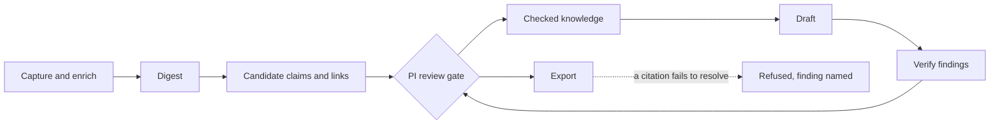

# Memoria

**The AI does the bookkeeping. You keep the judgment.**

Memoria is a local research engine for one researcher. It turns what you read
into checked notes, linked arguments, and drafts whose every citation must
resolve against a real source before anything leaves the workspace.

[Get started](how-to-guides/setup/quickstart.md) ·
[See a first session](#a-first-session) ·
[GitHub](https://github.com/eranroseman/memoria-vault)

**Status: v0.1 alpha source install** — what works today and what is still
landing: [Roadmap & status](roadmap.md).

---

## The problem it solves

Research vaults fail in one of two ways. **Capture without synthesis:** sources
pile up in an inbox and never connect — the vault grows but does not compound.
**Synthesis without rigor:** bullets replace citations, summaries drift from
what the papers actually say, and six months later you are afraid to rely on
your own notes.

Both are bookkeeping failures, and
[maintaining a knowledge base is a bookkeeping problem, not an intelligence
problem](explanation/rationale/foundations/what-memoria-is.md). Memoria gives
the bookkeeping — filing, linking, checking, re-checking — to the engine, and
keeps every judgment call with you.

## <a id="a-first-session"></a>A first session

The shape of one traversal, start to finish, run from the vault folder
(placeholders in angle brackets; the annotated walkthrough starts at
[Tutorial 02](tutorials/02-first-source.md) and runs through the
[tutorial sequence](tutorials/README.md)):

```text
$ memoria work add --workspace . --pdf <paper.pdf>
# the paper lands in the catalog as a work: source bytes stored as
# provenance blobs, full text extracted, the capture journaled

$ memoria work update --workspace . <work-id> --check-status checked
# the PI gate in one line: nothing counts as checked until you say so

$ memoria work digest --workspace . <work-id>
# a structured digest of the checked full text, for reading and linking

$ memoria new note --workspace . "<claim title>" --mode claim \
    --work-id <work-id> --body "<what the paper actually showed>"
# one claim note, linked to the source it came from

$ memoria ask --workspace . --question "<your question>"
# the checked sources that answer it, ranked, with honest unknowns
# (local BM25; no provider key needed)

$ memoria project verify --workspace . projects/<project>/project.md
# with a project draft in place (create, check, slice, compose — the
# Tutorial 04 loop): draft findings are reported; you resolve each one

$ memoria project export --workspace . projects/<project>/project.md --draft
# the draft export refuses unless every citation resolves — and the
# refusal names the failing citation
```

## What Memoria guarantees

Each promise is backed by a named mechanism, and the docs never claim un-built
behavior — anything not shipped is marked *planned* here and everywhere else.

**Shipped today:**

- **If a citation does not resolve, the export refuses.** Drafts leave the
  workspace only when every citation resolves against a source in the catalog —
  and the refusal names the failing citation, so nothing rots silently into
  your deliverables.
- **Provenance is recorded, not reconstructed.** Notes link to the works they
  came from, answers cite the corpus they were drawn from, and every machine
  write lands through a single journaled write path.
- **Come back after three months and pick up where you left off.** Attention
  cards show exactly what is waiting on you
  ([Return to work](how-to-guides/inbox/return-to-work.md)); nothing important
  lives only in a chat transcript.
- **Your words stay yours, in the open.** Notes, claims, hubs, and drafts are
  plain Markdown you can read with `cat`; system state rides in a single SQLite
  database plus an append-only journal under `.memoria/`; the whole vault
  travels as a folder copy.

**Planned — beta.1 milestone** ([Roadmap & status](roadmap.md)):

- **Every sentence in a draft will trace to a passage you can open** *(planned
  — grounded synthesis)*.
- **When a source falls, you will see everything it was holding up** *(planned
  — typed blast-radius propagation)*.
- **A first real answer from your own corpus in under 30 minutes** *(planned —
  the onboarding bar; it ships with the telemetry that measures
  it rather than asserting it)*.

## Who it's for

One researcher who reads a lot and has to defend what they write: a PhD
student building a literature base that must survive to the dissertation; a
principal investigator who returns to projects after months away; anyone who
has thought *"I know I read this somewhere"* or *"can I actually still cite
this?"*

If you want an AI that writes your paper for you, this is not it — and that is
the point. Memoria is not an autonomous researcher: nothing enters checked
knowledge and nothing exports without passing through you.

## Why not just…

| …use | The gap Memoria closes |
| --- | --- |
| **Zotero alone** | Stores sources; does not turn them into connected claims. Memoria imports its BibTeX/CSL exports and picks up where it stops. |
| **Obsidian alone** | Notes do not check themselves. Memoria keeps the plain-Markdown vault *and* checks links, citations, and structure. |
| **A chat assistant** | Chat memory dies with the transcript. Memoria files useful answers into durable, linkable artifacts. |
| **Deep Research tools** | One comprehensive report per query, then it forgets. Memoria curates a corpus that compounds across months. |

---

## The model

Memoria is a single-researcher operating system for turning sources into
defensible claims and drafts. The engine proposes; the PI disposes.



### The five terms

| Term | Meaning |
| --- | --- |
| PI | The human principal investigator. The PI decides what enters the vault and what can be cited. |
| Co-PI | The read-only conversational posture behind `memoria ask`. See [The Co-PI](explanation/execution/operation-postures/co-pi.md) for its full mission. |
| Operations | Checked capability-backed units of work such as capture, enrich, digest, ask, verify, and export. |
| Request table | The SQLite control plane. It records operation requests, status, blockers, review, and completion. |
| Workspace | The local folder tree. It holds knowledge bundles, catalog state, attention projections, and system outputs. |

### The working loop

1. Find a source.
2. Capture and enrich it into the catalog.
3. Distill checked Works into notes.
4. Link claims into a project argument.
5. Draft from current claims.
6. Verify the draft and resolve findings.
7. Archive or revise as the project changes.

The loop compounds because each step leaves a typed, linkable artifact in the
vault. Nothing important depends only on chat history.

### The control rule

Operations propose; the PI disposes. CLI commands, observed file changes, and
scheduled jobs can create request rows, attention prompts, and staged outputs
within their manifest scope. Promotion into review-gated knowledge stays
PI-directed and policy-gated.

---

## Where do you want to go?

| I want to…                                  | Go here                                                                                           |
| ------------------------------------------- | ------------------------------------------------------------------------------------------------- |
| **Understand the system model**             | [The model](#the-model)                                                                           |
| **Get set up for the first time**           | [Quickstart — set up your vault](how-to-guides/setup/quickstart.md)                                |
| **Do something specific**                   | [How-to guides](how-to-guides/README.md)                                                          |
| **Look up a field, command, or schema**     | [Reference](reference/README.md)                                                                  |
| **Understand how the system fits together** | [Explanation](explanation/README.md)                                                              |
| **Understand why it is designed this way** | [Design rationale](explanation/rationale/README.md)                                                |
| **See what is shipped vs. planned**         | [Roadmap & status](roadmap.md)                                                                    |
| **Fix something broken**                    | [Failure modes](reference/system/failure-modes.md) · [Troubleshooting](how-to-guides/troubleshooting/README.md) |

---

## Common tasks

**First session**
[Quickstart](how-to-guides/setup/quickstart.md) · [01: System tour](tutorials/01-system-tour.md) · [Set up the vault](how-to-guides/setup/set-up-the-vault.md)

**Daily work — sources**
[Capture and ingest](how-to-guides/library/capture-and-ingest.md) · [Discuss a paper](how-to-guides/library/discuss-a-paper.md)

**Daily work — knowledge and projects**
[Query the vault](how-to-guides/knowledge/query-the-vault.md) · [Build a hub](how-to-guides/knowledge/build-a-hub.md) · [Analyze a project argument](how-to-guides/project/analyze-a-project-argument.md) · [Export a draft](how-to-guides/project/export-a-draft.md)

**Weekly**
[Return to work](how-to-guides/inbox/return-to-work.md) · [Weekly review](how-to-guides/inbox/run-the-weekly-review.md) · [Run the Linter](how-to-guides/operate/run-the-linter.md)

**Troubleshooting**
[Safe mode](how-to-guides/troubleshooting/safe-mode.md) · [Failure modes reference](reference/system/failure-modes.md)

---

## Start

Install or set up a vault with [Quickstart](how-to-guides/setup/quickstart.md),
then begin with [01: System tour](tutorials/01-system-tour.md) and continue
through the [Tutorials](tutorials/README.md) in order.

Want the model before the workflow? Read
[What Memoria is](explanation/rationale/foundations/what-memoria-is.md), then
[Architecture](explanation/architecture/README.md),
[The vault](explanation/architecture/vault.md),
[The knowledge cycle](explanation/knowledge/knowledge-cycle.md), and
[The control plane](explanation/execution/control-plane/README.md).

[**Tutorials**](tutorials/README.md) — Guided first workflow over the current CLI/runtime.

[**How-to guides**](how-to-guides/README.md) — Task recipes.

[**Reference**](reference/README.md) — Exact fields, commands, schemas, settings, and paths.

[**Explanation**](explanation/README.md) — Architecture, workflows, conceptual model, and design rationale.

Editing these docs? The authoring conventions live in
[Contributing](https://github.com/eranroseman/memoria-vault/blob/main/CONTRIBUTING.md#documentation-authoring-conventions).
