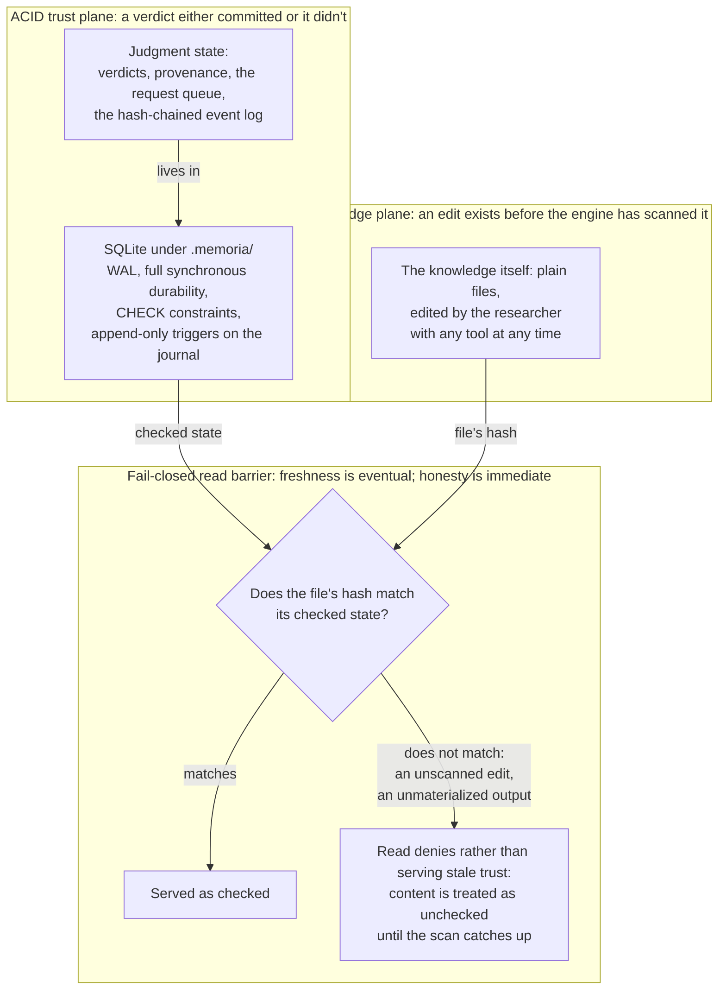

# Consistency model

Memoria runs two planes with different guarantees, joined by a fail-closed
boundary.

## ACID trust plane

Judgment state — verdicts, provenance, the request queue, the hash-chained
event log — lives in SQLite under `.memoria/`, with WAL, full synchronous
durability, CHECK constraints, and append-only triggers on the journal. What
the system asserts about trust is transactional: a verdict either committed
or it didn't.

The chain is a mechanism to check, not just to have: `memoria journal verify`
walks it end to end and reports the first broken link, so trust is a
verifiable claim with one authoritative read path, not an assumption resting
on WAL and CHECK constraints alone.

## BASE knowledge plane

The knowledge itself is plain files, edited by the researcher with any tool
at any time. Files are eventually consistent with the engine's view of them:
an edit exists before the engine has scanned it.

## Fail-closed reads: eventual freshness, immediate honesty

The boundary is the read barrier, and it fails closed. When a file's hash
does not match its checked state — an unscanned edit, an unmaterialized
output — reads *deny* rather than serve stale trust: content is treated as
unchecked until the scan catches up. Freshness is eventual; honesty is
immediate. No consumer is ever told "checked" about bytes the checks never
saw.

The two planes and the barrier branch that joins them:

## Cross-substrate operations

> **Planned (beta.1):** The complete cross-substrate recovery sequence described below is not yet shipped.

Operations that touch both planes (stage → validate → promote → journal →
git) run as an outbox-style sequence coordinated from SQLite, with
fail-closed recovery as the compensation path: after a crash, every
interrupted machine operation resolves to committed-and-consumable,
retryable-and-pending, or failed-and-hidden. No torn output is ever visible
as checked.

## Durability beyond the database

WAL and synchronous commits protect against a mid-write crash; they do not
protect against a lost or corrupted disk. `memoria workspace backup <target>`
verifies and reconciles the journal, then publishes one complete snapshot
outside the live vault; `memoria workspace restore <source>` validates that
snapshot and restores it. `memoria doctor` fails when a blob has no
corresponding backup — an unbacked blob is a durability gap, not a passing
state.

## Related

- [Memory model](memory-model.md) — which substrate owns which data.
- [OKF and portability](okf-and-portability.md) — why the planes are separate.
- [Failure modes](../../reference/system/failure-modes.md) — the recovery matrix.
- [Back up and restore the workspace](../../how-to-guides/operate/back-up-and-restore-the-workspace.md) — how to run the backup and restore commands.
- [Backup and recovery](../../reference/system/backup-and-recovery.md) — the backup and restore reference.
