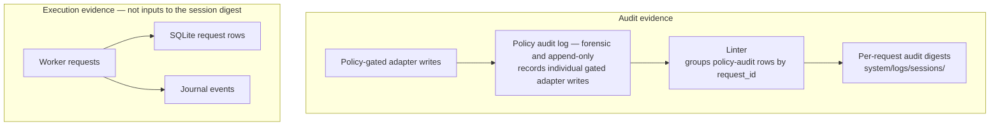

# Session logging

Session logging is a system mechanism, not a workflow. Policy-gated adapter
writes produce audit-log evidence; worker requests and trusted-writer commits
also leave SQLite and journal evidence. No card exists, and there is nothing to
claim or transition. Logging runs underneath request-driven workflows rather
than being one of them.

A second, per-request audit digest — a deterministic derivative the Linter
writes from policy-audit rows grouped by `request_id` — accumulates alongside
it under `system/logs/sessions/`. It does not summarize SQLite worker-request
rows or journal events. This page explains the two-log design and why these
evidence streams stay separate.

---

## Two logs

The audit log and its per-request digests are different artifacts for different
readers. The policy audit log records individual gated adapter writes for
forensic review; its digest compacts those audit rows for one `request_id`.
SQLite request rows and journal events remain separate evidence of
worker-controlled work.

The audit log and its digest preserve audit evidence, while SQLite request and
journal records preserve execution evidence. This page does not cover the
separate diagnostics plane described in
[Telemetry architecture](telemetry-architecture.md).

Both evidence streams, each derived end to end with nothing crossing between
them:

The exact paths, writers, and retention contract belong in [Memory
substrates](../../reference/pipelines-and-io/memory-substrates.md) and [Policy audit
log](../../reference/control-and-policy/policy-audit-log.md).

---

## Why the two-log separation

The policy audit log answers "did this adapter write happen and was it
authorized?" — it is forensic and append-only. Because each policy write is
hash-paired (the mechanism is owned by
[Policy audit log](../../reference/control-and-policy/policy-audit-log.md)), a write can be
reversed and an edit made outside the trail is detectable; the Linter closes the
loop over this evidence with audit and hash-drift detectors. Per-request
digests make that same policy-audit evidence easier to inspect without
replacing the detailed log. SQLite request rows and journal events answer what
the worker request accomplished; they are not inputs to the session digest.

Combining audit, request/journal, and diagnostic evidence would blur their
different authorities. The audit log feeds tamper detection and may feed
optional dashboards; its per-request digests help the PI review the recorded
adapter activity. The decision is [quarantine-and-verify with durable,
audit-logged crash recovery](https://github.com/eranroseman/memoria-vault/blob/main/design-history/arcs.md).

---

## Filename collision safety

Per-request files use a `YYYY-MM-DD-HHMM` base name from the earliest valid
policy-audit timestamp.
Requests that share a start minute receive deterministic `-2`, `-3`, … suffixes,
so the names stay stable and sortable. The supported deployment model remains
local-only; multi-machine sync needs its own deployment decision before support.

---

## Related

- The Linter operation (reads `system/logs/`; runs the integrity checks; writes the request digests): [Operations](../execution/operations.md)
- Session-log granularity (per-request files, not per-action): [Memory substrates](../../reference/pipelines-and-io/memory-substrates.md)
- Audit log contract: [Policy audit log](../../reference/control-and-policy/policy-audit-log.md)
