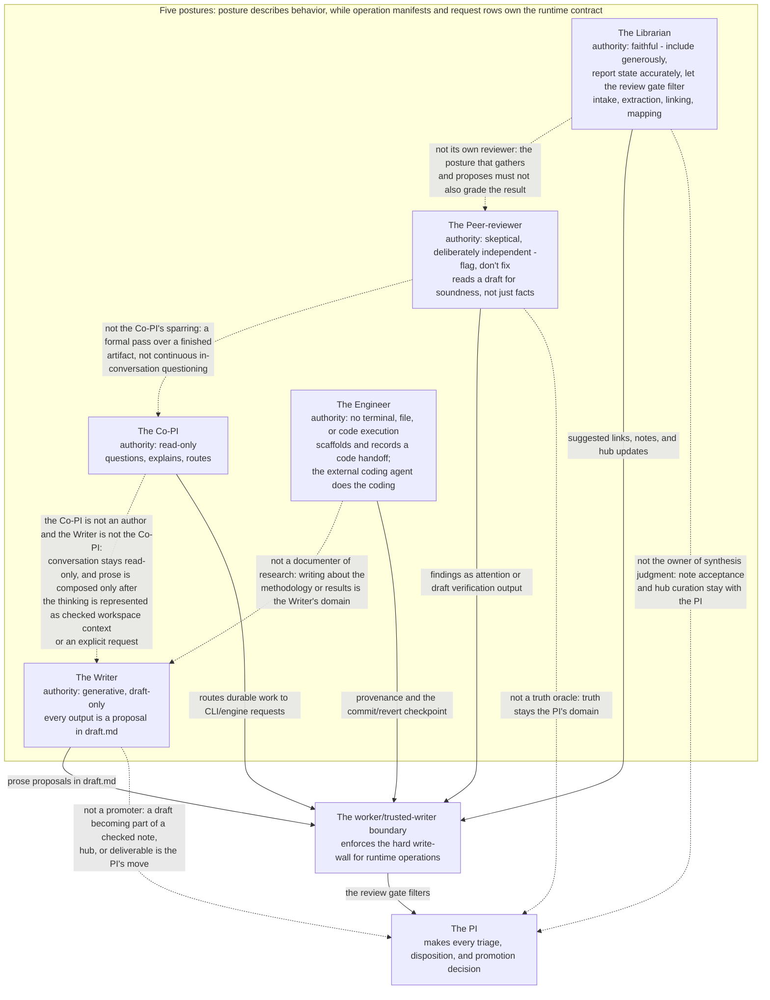

# Operation postures

Operation postures replace the old installed-profile language with drafting and
review stances the CLI and operations adopt. The important change is ownership:
posture describes behavior, while operation manifests and request rows own the
runtime contract.

The durable source of truth is now
`src/memoria_vault/product/capabilities/operations/` plus the standalone
CLI/engine. Optional adapters may present chat or board
interfaces, but they must call the same engine and may not become the authority
for capabilities, provider config, or write policy.

## Documents in this section

| Page | What it covers |
| --- | --- |
| [The Co-PI](co-pi.md) | The conversational, read-only posture behind `memoria ask` — questions, explains, and routes durable work to CLI/engine requests. |
| [The Librarian](librarian.md) | The faithful intake-through-mapping posture — catalog, extract, link, and map operations that surface candidates and gaps. |
| [The Writer](writer.md) | The generative, draft-only posture that turns checked evidence into structured prose proposals. |
| [The Peer-reviewer](peer-reviewer.md) | The skeptical, independent verification posture that flags soundness issues without auto-fixing them. |
| [The Engineer](engineer.md) | The handoff posture that scaffolds and records external coding work without granting Memoria code-execution authority. |

How the five postures relate to each other, to the write boundary, and to the
PI:

## Delegation posture

Delegation is request based in the standalone runtime. A request can narrow scope through input
refs, output intents, and required checks, but it cannot widen the operation
manifest's authority.

## Related

- Current command surface: [CLI](../../../reference/commands-and-transports/cli.md)
- Operation manifests: [Operations](../../../reference/commands-and-transports/operations.md)
