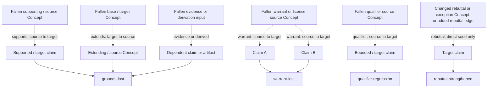

# Consequence propagation

> **Shipped:** Typed consequence propagation and eager write-time marking run in
> the current graph substrate. Typing the complete six-role Toulmin graph
> remains planned for beta.1.

Memoria's central operation is what happens *after* a change to the knowledge
base. Any change or addition — a new claim, an edited note, a new or changed
edge, a retracted source, a claim the researcher decides is wrong — has
consequences for everything grounded on it, and the graph's job is to make
those consequences visible instead of letting them rot silently.

## Typed blast radius

Because the graph carries [Toulmin roles](../rationale/foundations/intellectual-foundations.md),
the consequences are *typed*, not generic. When a node falls, its dependents
experience different events:

- **Grounds lost** — a claim's evidence went away; the claim stands unsupported.
- **Warrant lost** — the inference license connecting evidence to claim fell;
  every argument that license covered is affected at once.
- **Qualifier-bounded regression** — a hedged claim degrades only within its
  stated bounds.
- **Rebuttal strengthened** — a counter-argument gains force when its target
  weakens.

Typed roles are what let the graph route each dependent to the right
disposition.

## The shipped routing graph

The engine follows only the routes below. The standard closure direction is
source to target; `extends` is the exception, traversed from its base target
back to its extending source. One warrant or license can therefore affect more
than one claim.

`rebuttal-strengthened` is a direct seed result: when a rebuttal or exception
Concept changes, its `rebuttal` relation marks the target claim; adding a
`rebuttal` edge likewise marks that edge's target claim. It is not a generic
transitive hop.
The traversal deliberately does not continue through `rebuttal`,
`contradicts`, or `tension`; those relations do not route a generic consequence.
No `grounds` relation exists — grounds loss follows the shipped
`supports`, `extends`, evidence, and derivation routes shown above.

## Consequences are marked at write time

Derivation happens on write: the moment a change lands, its blast radius is
computed and affected nodes are marked — stale, under-grounded, needing
re-confirmation — so the knowledge base is always current and the researcher
gets immediate feedback. Reads may come weeks later; even hours of staleness
can mislead. Re-confirmation of impacted nodes is then *lazy and
impact-ranked*: marking is eager, re-verification effort follows the
researcher's attention to what matters.

## Origin-blind, authority-gated

Epistemic consequences are origin-blind while write and revert *authority*
stays origin-gated; the full principle statements are
[Design principles](../rationale/foundations/design-principles.md) 11–12.

## Related

- [Intellectual foundations](../rationale/foundations/intellectual-foundations.md) — the Toulmin pillar.
- [Knowledge cycle](knowledge-cycle.md) — where propagation sits in the daily loop.
- [Promotion and the write boundary](promotion-and-gated-zones.md) — states, not places.
