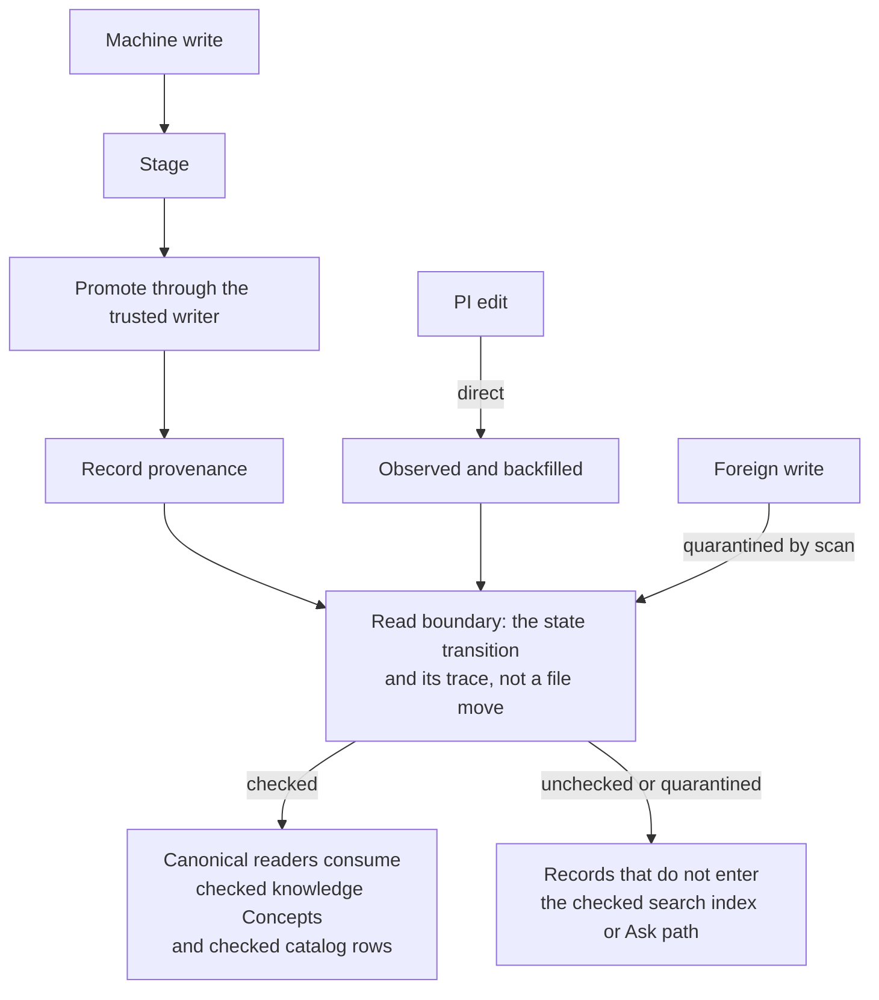

# Promotion and the write boundary

Promotion is the act of making content readable as checked knowledge. The PI
still decides what claims, links, and hub curation mean; the worker owns the
mechanical write boundary and the trace that proves it happened.

---

## What "canonical" means now

Canonical readers consume checked knowledge Concepts and checked catalog rows.
Other records can exist, but they do not enter the checked search index or Ask
path.

Promotion is not a file move. A Concept is born in its type home and stays
there; the boundary is the **state transition** and its trace. Machine writes
stage first, promote through the trusted writer, and record provenance. PI edits
are direct and then observed/backfilled. Foreign writes are quarantined by scan.

Three write origins, three distinct mechanics, one read boundary they all land
on:

What is deliberately not reintroduced: a per-write approval loop. The PI enters
for direction, curation, direct edits, and high-risk `ask` flags, not as a
rubber stamp on every machine write.

---

## What the flag router hands you

Checks separate deterministic fixes from PI decisions and low-value findings.
The exact route labels belong in the control-plane reference; the design point
is that not every check result deserves the PI's attention.

---

## Notes Replace Claim Maturity

The old `claim` type and maturity ladder are retired. Memoria uses one note type
plus evidence, links, and hub/project context. A note is safe to read when it is
checked; whether the claim is important is represented by its relationships.

---

## Related

**Explanation**

- The types involved: [Document types and epistemic roles](document-types.md)
- Why state replaced folders: [Lifecycle and state](../rationale/knowledge-rationale/lifecycle-and-state.md)
- The attention prompt in detail: [The honesty prompt](../execution/control-plane/honesty-card.md)
- Review gates vs work prompts: [Decision points](../execution/control-plane/decision-points.md)
- The operations behind the boundary: [Operations](../execution/operations.md)
- Why the gate is structural, not a policy toggle: [Why the review gate is structural](../rationale/boundaries/why-review-gate-is-structural.md)

**Decisions**

- [Checked means checks passed, not a human verdict](https://github.com/eranroseman/memoria-vault/blob/main/design-history/arcs.md) — historical work-prompt and batch-worklist decision
