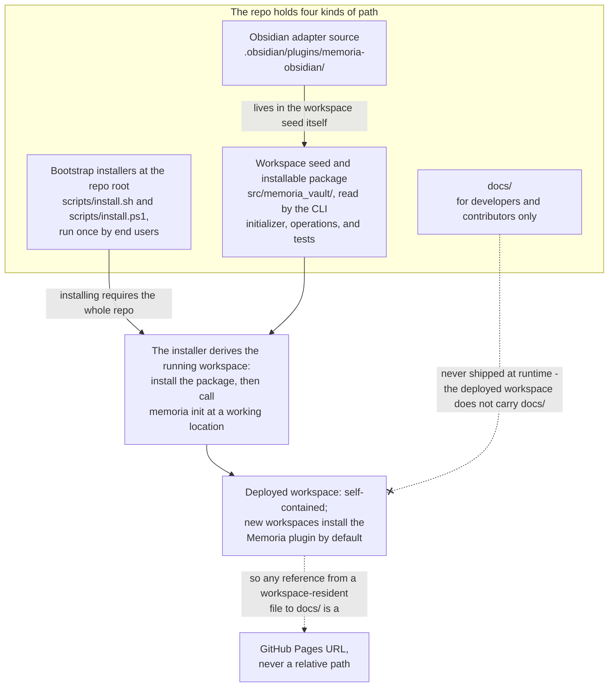

# Distribution model

Memoria ships from the `memoria-vault` repo as a packaged workspace seed plus an
installable Python package ([standalone engine with operations as product code, no agent tools](https://github.com/eranroseman/memoria-vault/blob/main/design-history/arcs.md)).
You clone it, or run the one-line bootstrap that clones it for you, and the
bootstrap installer at the repo root deploys the standalone workspace.

The repo holds four kinds of path, each with a different audience. The
**bootstrap installers** at the repo root (`scripts/install.ps1` /
`scripts/install.sh`) are run once by end users. The **workspace seed and
installable package** under `src/memoria_vault/` are read by the CLI
initializer, operations, and tests. The **Obsidian adapter source** lives in the
workspace seed itself (`.obsidian/plugins/memoria-obsidian/`), so new
workspaces install the Memoria plugin by default;
`packages/memoria-obsidian/` holds only its node test harness. And
`docs/` is for developers and contributors only - never shipped at runtime.
See [On-disk layout](../../../reference/system/on-disk-layout.md) for the
full path inventory.

The installer derives the running workspace by installing the package and
calling `memoria init` at a working location. The deployed workspace is
self-contained - it does not carry `docs/`, so any reference from a
workspace-resident file to `docs/` is a **GitHub Pages URL, never a relative
path**. The installers live at the repo root (not inside `src/`) because the
bootstrap is the clone/entry point; installing requires the whole repo. See
[Bootstrap installer](bootstrap-installer.md) for the installer's design and
[Installer (bootstrap)](../../../reference/system/installer.md) for the component inventories.

The four path kinds, and where each one ends up:

The old `vault-template/` tree was removed in
[alpha.20](https://github.com/eranroseman/memoria-vault/blob/main/design-history/20-alpha.20.md). A second source tree had
become a retention mechanism for empty directories, historical files, dashboards,
templates, and broad adapter payloads. The workspace seed keeps files the
runtime or default Obsidian workspace reads; writable and generated paths are
created by code from schema or projection contracts.

---

## What Ships In The Package Seed

`src/memoria_vault/product/workspace_seed/` carries only workspace seed files. The
full directory catalog is [On-disk layout](../../../reference/system/on-disk-layout.md); the
category-tree rationale is [The vault](../../architecture/vault.md).
Empty content dirs are recreated from `.memoria/schemas/folders.yaml`.

## Product-file refresh

Memoria does not maintain an in-vault product-file restore baseline. Product
files come from the installed `memoria_vault` package; repair is
`memoria doctor --repair` or package reinstall, not migration or three-way
reconciliation inside the vault.

---

## Capabilities, Not Installed Profiles

Memoria ships capability manifests inside the Python package under
`src/memoria_vault/product/capabilities/`, with one checked Markdown file per
operation. Those manifests are the runtime allowlist; see
[Operations](../../../reference/commands-and-transports/operations.md) for
the manifest fields.

The repo deliberately does not ship `.memoria/profiles/`,
`.memoria/lane-overrides/`, or a profile-rendering script. The
standalone `memoria` CLI and engine are the product surface. The seeded Obsidian
adapter may call the same CLI/runtime, but it is not the source of truth for
capabilities and does not write Memoria-owned state outside `/operation/run`.

The absence is test-pinned by `tests/test_profiles.py` and
`scripts/checks/removed_surface_gate.py`.

---

## Running more than one vault

Nothing in the distribution model is single-vault by design. The rule is simple:
give each workspace its own directory, `.memoria/memoria.sqlite`, search index
state, Git history, and provider config. Optional app adapters must attach to
one workspace at a time and preserve the CLI/runtime as the write path.

---

## Related

- The installer's design: [Bootstrap installer](bootstrap-installer.md)
- The decision: [alpha.15 standalone engine checkpoint](https://github.com/eranroseman/memoria-vault/blob/main/design-history/15-alpha.15.md) (consolidates the former src-scaffold and repo-as-install-unit decisions)
- Capability reference: [Operations](../../../reference/commands-and-transports/operations.md)
- On-disk layout reference: [On-disk layout](../../../reference/system/on-disk-layout.md)
