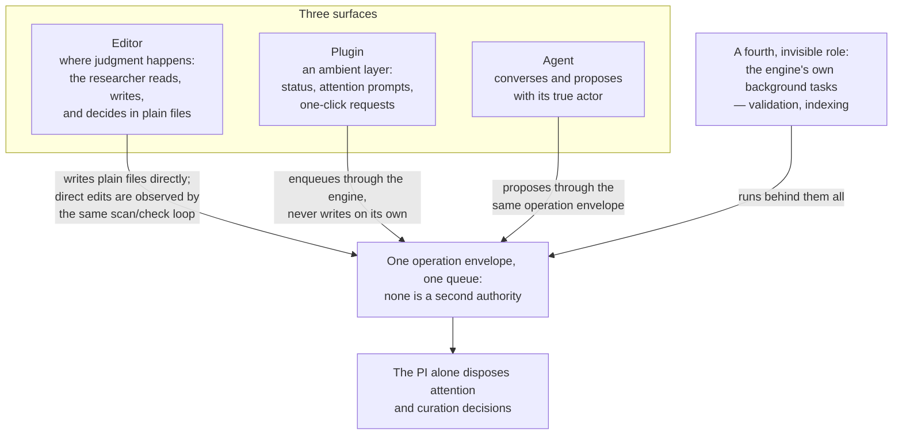

# Surfaces

Surfaces explain what the PI sees. They render engine state and editor context,
but they do not own workflow state or write authority. For the visual/voice
design constraints those surfaces follow, see [Surface design
rationale](../rationale/surfaces/README.md).

## The division of labor

Three surfaces, one envelope: the **editor** is where judgment happens — the
researcher reads, writes, and decides in plain files; the **plugin** is an
ambient layer — status, attention prompts, and one-click requests — that enqueues
through the engine but never writes on its own; the **agent** converses and
proposes through the same operation envelope with its true actor. The PI alone
disposes attention and curation decisions. A fourth, invisible role (the
engine's own background tasks — validation, indexing) runs behind them all.
Every surface goes through the same queue; none is a second authority.

**Shipped.** `memoria help` presents five jobs regardless of surface:
Read, Knowledge, Project, Review, and Upkeep. ("Jobs" here is the
work-category taxonomy, unrelated to the engine's own background tasks above.)

**Planned beta.1.** Deep work (compose, canvas, drafting) stays separate
from task work (inbox, review queues, maintenance) — the compose surface never
shows the recommendation stream. And the keep-test governs all of it: the
product must remain fully operable with `vim` and a file browser; every
deep-work artifact is a plain file; the plugin is never the only way in.

| Page | What it covers |
| --- | --- |
| [Dashboards](dashboards/README.md) | How shipped health data and planned composite views relate |
| [Obsidian](obsidian/README.md) | Optional editor integration boundaries |
