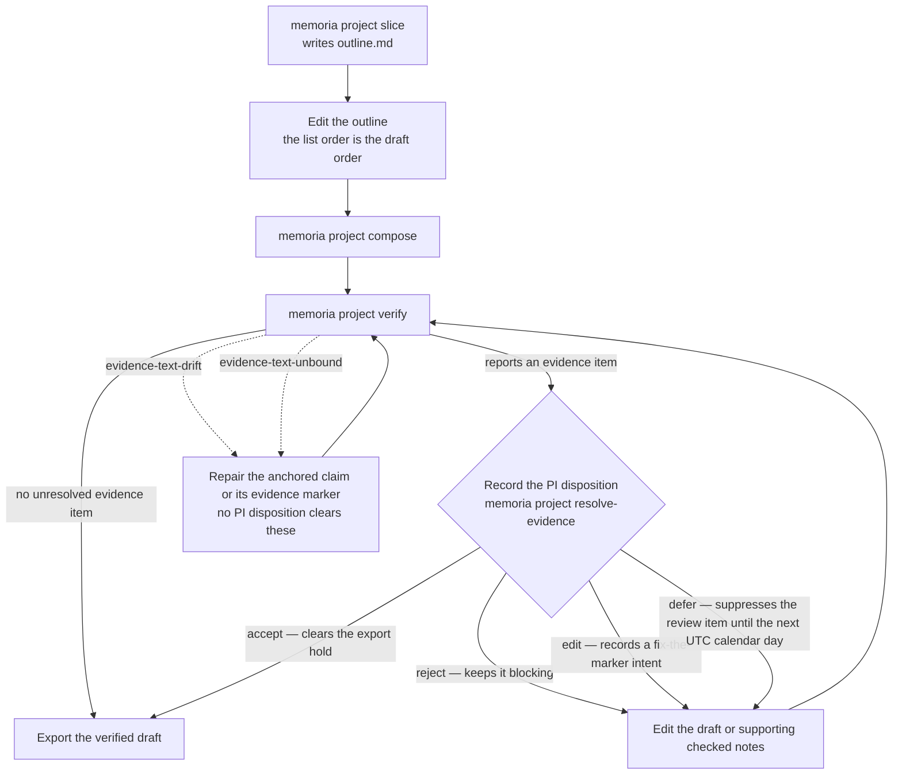

# Compose a draft

Use the project **WRITE loop** — the engine's produce-and-write-back path
(project slice → outline → draft → verify/export → passage write-back; see
[Why the write half is bounded](../../explanation/rationale/boundaries/why-write-half-is-bounded.md))
— when checked notes are ready to become prose.

## Prerequisites

- A checked Project under `projects/`
- Checked notes that belong in the project argument
- Typed links or clear evidence relationships among the notes

## Steps

**1. Propose the project slice.**

```bash
memoria project slice --workspace <vault> projects/<project>/project.md --query "<topic>"
```

The command writes `projects/<project>/outline.md`.

**2. Edit the outline.**

Keep only the notes that belong in the draft. The list order is the draft order;
typed links stay on the notes themselves.

**3. Compose and verify the draft.**

```bash
memoria project compose --workspace <vault> projects/<project>/project.md
memoria project verify --workspace <vault> projects/<project>/project.md
```

## Resolve evidence review

If verification reports an evidence item, record the PI disposition — `accept`,
`reject`, `edit`, or `defer`. Only `accept` clears the export hold; `reject`
keeps it blocking, `edit` records a fix-the-marker intent with a deep link to
the draft block, and `defer` suppresses the review item until the next UTC
calendar day:

```bash
memoria project resolve-evidence --workspace <vault> projects/<project>/project.md \
  --evidence-id ev-1234abcd \
  --decision accept \
  --reason "Reviewed source span"
```

Then edit the draft or supporting checked notes and run verification again. A
PI disposition can clear eligible evidence-review work, but it cannot clear
`evidence-text-drift` or `evidence-text-unbound`; repair the anchored claim or
its evidence marker instead.

The loop, with the evidence-review gate and the two findings no disposition can
clear:



## Promote reusable prose

If a passage should become durable knowledge:

```bash
memoria project promote --workspace <vault> projects/<project>/project.md \
  --title "Atomic note title" \
  --passage "Exact draft passage"
```

The promoted note is unchecked until reviewed.

## Verify

- `projects/<project>/outline.md` contains the intended checked notes.
- `projects/<project>/draft.md` exists.
- `memoria project verify` reports no unresolved evidence item you still need to handle.

## Related

- Argument analysis before drafting: [Analyze a project argument](analyze-a-project-argument.md)
- Batch-review evidence sets after verification: [Work the evidence-set review queue](work-the-evidence-set-review-queue.md)
- Export the verified draft: [Export a draft](export-a-draft.md)
- Routes, states, and failure modes: [Export routes and formats](../../reference/pipelines-and-io/export.md)
- Project type: [Document types](../../reference/data-model/document-types.md)
