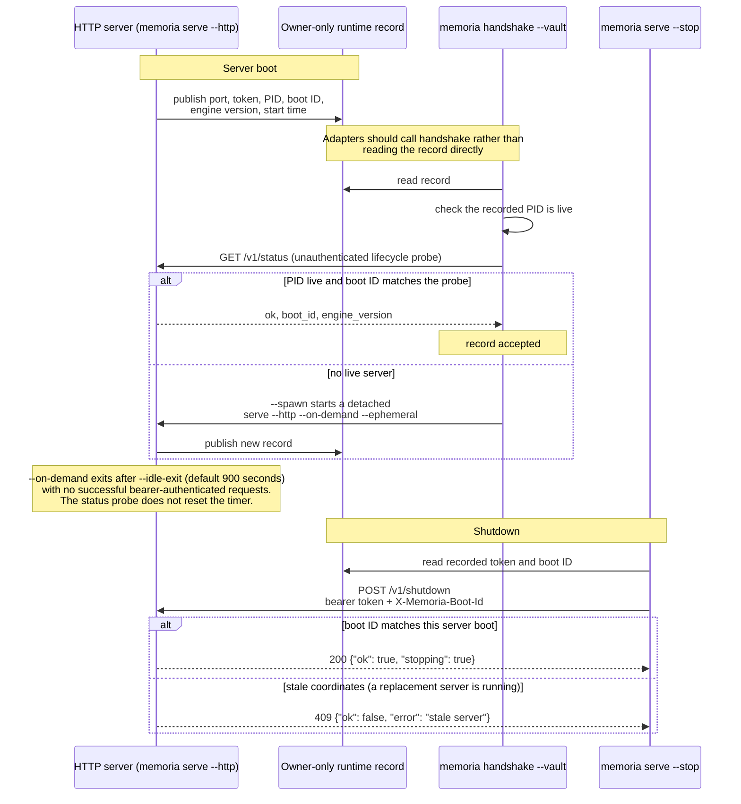

# Local HTTP transport

The local HTTP transport is the REST-like adapter surface for editor plugins and
debug scripts. It is a loopback transport over `memoria_vault.engine.api` with
bearer-authenticated operational endpoints and a small unauthenticated
lifecycle probe; it is not a remote service, OAuth API, or alternate state
owner.

## Start

```bash
memoria serve --workspace <path> --http --host 127.0.0.1 --port 8765
```

`--host` accepts only `127.0.0.1` or `localhost`; IPv6 loopback (`::1`) is not
an accepted bind target. `--read-scope <path>` may be repeated to set the
maximum readable workspace scope for the server. If `MEMORIA_HTTP_TOKEN` is
set, the server uses it and does not print the token. If it is unset, the CLI
generates one token for that server run and prints it. Use `--json` when an
adapter needs to parse the selected URL and token source.

The default port choice, `8765`, tries the local range through `8785`; a
non-default `--port` tries only that port. `--ephemeral` asks the OS for a free
port instead.

`--once` binds and publishes startup coordinates, then clears them and closes
the server before printing its payload. It is for smoke tests, not serving
traffic.

## Loopback and authentication

Every request must carry exactly one `Host` header naming the actual port as
`127.0.0.1:<port>` or `localhost:<port>`. An `Origin` header may be absent or
be exactly `app://obsidian.md`; another origin, or repeated `Origin` headers,
is forbidden.

`GET /v1/status` is the sole endpoint without bearer authentication. Every
other endpoint, including the engine `GET /status` route and lifecycle shutdown,
must include:

```http
Authorization: Bearer <token>
```

There is no TLS, cookie auth, browser session, OAuth flow, or remote bind mode.
The intended caller is a local trusted adapter attached to one workspace.

## Lifecycle and rendezvous

The rendezvous sequence — the server writes the runtime record, while
`memoria handshake` and `memoria serve --stop` only read it:



Each live server publishes an owner-only runtime record outside the vault in a
private, per-vault local-state directory. It carries the selected port, token,
PID, boot ID, engine version, and start time. Adapters should use
`memoria handshake --vault <path>` rather than read that record directly:
handshake accepts a record only when its PID is live and its boot ID matches the
server's lifecycle probe. `memoria handshake --vault <path> --spawn` starts a
detached `serve --http --on-demand --ephemeral` server when no live one exists.

`memoria serve --http --on-demand` exits after a period with no successful
bearer-authenticated requests; `--idle-exit` defaults to 900 seconds. The
unauthenticated status probe does not reset that timer. `memoria serve --stop`
uses the recorded token and boot ID to request shutdown, so stale coordinates
are rejected rather than stopping a replacement server.

## Endpoints

Only `GET` and `POST` are implemented.

| Method | Path | Parameters or body | Engine call or action |
| --- | --- | --- | --- |
| `GET` | `/v1/status` | none; no bearer token | Lifecycle probe returning `ok`, `boot_id`, and `engine_version`. |
| `GET` | `/status` | none | `read_status(workspace)` |
| `GET` | `/operations` | none | `read_operations(workspace)` |
| `GET` | `/openapi.json` | none | OpenAPI 3.1 document generated from the surface contract |
| `GET` | `/requests` | `status`, `read_scope` or `scope` | `read_requests(...)` |
| `GET` | `/request` | `id`, `read_scope` or `scope` | `read_request(...)` |
| `GET` | `/attention` | `status`, `kind`, `worklist=true`, `read_scope` or `scope` | `read_attention(...)` |
| `GET` | `/attention/card` | `path`, `read_scope` or `scope` | `read_attention_card(...)` |
| `GET` | `/v1/views/attention` | `summary=true`, `read_scope` or `scope` | `read_attention_view(...)` |
| `GET` | `/v1/views/evidence-review` | `routing_type`, `project`, `min_age_days` (0 means no age filter), `batch` (positive), `read_scope` or `scope` | `read_evidence_review_view(...)` |
| `GET` | `/v1/views/dashboard` | none; workspace-wide, so `read_scope` does not narrow it | `read_dashboard_view(workspace)` |
| `GET` | `/concepts` | `type`, `read_scope` or `scope` | `read_concepts(...)` |
| `GET` | `/concept` | `target`, `read_scope` or `scope` | `read_concept(...)` |
| `GET` | `/work` | `id`, `read_scope` or `scope` | `read_work(...)` |
| `GET` | `/journal` | `operation`, `request_id`, `path`, `decision`, `date`, `limit`, `read_scope` or `scope` | `read_journal(...)` |
| `GET` | `/journal/event` | `event_id`, `read_scope` or `scope` | `read_journal_event(...)` |
| `GET` | `/project/slice` | `project_path`, `read_scope` or `scope` | `read_slice(...)` |
| `GET` | `/project/draft` | `project_path`, `read_scope` or `scope` | `read_draft(...)` |
| `GET` | `/project/canvas/forks` | `project_path`, `read_scope` or `scope` | `read_canvas_forks(...)` |
| `GET` | `/exploration` | `limit`, `read_scope` or `scope` | `read_exploration(...)` |
| `POST` | `/operation/run` | JSON object; see below | `run_operation(...)` |
| `POST` | `/v1/shutdown` | bearer token plus exactly one matching `X-Memoria-Boot-Id` header | Stop this boot instance and return `{"ok": true, "stopping": true}`. |

`GET /openapi.json` is generated from the surface contract registry; it is the
machine-readable route and parameter mirror.

## Read Scope

HTTP can be started with `--read-scope <path>` to set the maximum readable
scope. HTTP reads also accept optional `read_scope` query parameters; `scope` is
an alias. Query values may be repeated or comma-separated:

```text
/concepts?read_scope=notes/alpha.md&read_scope=projects/demo
/concepts?scope=notes/alpha.md,projects/demo
```

Scopes are normalized as workspace-relative paths. Root scope (`/` or `.`) and
path traversal are rejected. If startup scope and query scope are both present,
the effective scope is their intersection: a request may narrow the startup
scope, never widen it. Disjoint scope intersection returns no scoped rows or a
not-found response. If no startup or query scope is supplied, HTTP reads are
unscoped; that is appropriate only for a trusted local adapter.

## Operation Writes

`POST /operation/run` accepts this JSON object:

```json
{
  "operation_id": "create-concept",
  "payload": {},
  "idempotency_key": "optional-stable-request-id",
  "schedule_id": "optional-schedule-id",
  "agent_identity": "optional-concrete-agent-name"
}
```

`operation_id` is required. `payload` must be an object; non-object payloads are
treated as `{}`. The transport records every operation request with actor `pi`;
callers cannot select another actor, and an `actor` field in the request body is
ignored. `agent_identity`, when supplied, is provenance metadata. This adapter
has no dedicated request-control or evidence-disposition *endpoint*; the PI
operations themselves are reachable through `POST /operation/run`.

The door assigns `pi` because this surface is the PI's own hand: it binds only to
loopback, admits only the `Host` and `Origin` values above, and requires the
per-boot bearer token the user holds. That grant is door-wide, not per-operation
— every operation reachable through `POST /operation/run` runs with PI
authority, including every PI-reserved operation in the
[Actor Authority Guard](../control-and-policy/control-plane.md#actor-authority-guard)
(`cascade-rollback`, `resolve-evidence`, `promote-draft-passage` and
`capture-remote-pdf-source` among them).
The `integrity`-reserved operations remain refused here: the worker fails such a
request (`<operation_id> requires <label> actor authority`), surfaced through the
`Operation ran but worker failed it` → `200 {ok: false}` row below. The
[MCP transport](mcp-transport.md), which has no such caller authentication,
keeps actor `agent`.

The grant is authority, not authorship. Every request the door enqueues is marked
machine-authored, so Concept bodies posted here are neutralized before they are
written — image embeds and raw HTML become inert and links become non-clickable
code spans — exactly as they are for actor `agent`. Only the PI's own hand at the
CLI writes a body verbatim. The transport records write provenance as:

```json
{"surface": "memoria-http", "command": "http:<operation_id>"}
```

The worker owns operation validation and materialization. For example,
`create-concept` still rejects target paths outside the declared Concept home
and leaves the new Concept unchecked.

An idempotency key binds the complete request envelope. Repeating the same
envelope returns the existing request. A request that reuses the key with a
different envelope is rejected with `400`.

## Responses

Responses are JSON with `Content-Type: application/json; charset=utf-8`, plus
`X-Content-Type-Options: nosniff` and `Cache-Control: no-store` on every reply.
Engine read payloads include `ok: true` and `api_version: engine-read-api.v1`.
`GET /openapi.json` and `GET /v1/status` are exceptions: the former returns a
raw OpenAPI 3.1 document, and the latter returns its small lifecycle document,
so neither carries `api_version`.

Current status behavior is intentionally small:

| Case | HTTP status | Body |
| --- | --- | --- |
| Missing or wrong `Host`, or forbidden `Origin` | `403` | `{"ok": false, "error": "forbidden host"}` or `{"ok": false, "error": "forbidden origin"}` |
| Missing or wrong bearer token on an endpoint other than `GET /v1/status` | `401` | `{"ok": false, "error": "unauthorized: missing or invalid bearer token"}` |
| Bad JSON, non-object body, missing or invalid parameter, root/traversing scope | `400` | `{"ok": false, "error": "..."}` |
| Unknown route or engine not-found | `404` | `{"ok": false, "error": "..."}` — unknown routes read `no such route: <path>` |
| Known route with unsupported method | `405` | `{"ok": false, "error": "method not allowed: <METHOD> <path>"}` |
| Missing or stale boot ID on `POST /v1/shutdown` | `409` | `{"ok": false, "error": "stale server"}` |
| Body over `MAX_BODY_BYTES` | `413` | `{"ok": false, "error": "request body too large"}` |
| Operation ran but worker failed it | `200` | `{"ok": false, "job": ..., "result": ...}` |

No CORS, `OPTIONS`, SSE, or WebSocket behavior is implemented.

## Boundaries

- The transport never opens SQLite or workspace files directly.
- It does not call the optional adapter policy hook; operation writes enter the
  engine request envelope instead.
- The lifecycle routes do not call the engine API. Their narrow purpose is to
  validate a rendezvous record or stop its exact server boot.
- Threaded HTTP requests are safe for local use because worker mutation is
  serialized by the workspace worker lock.
- Browser-like clients may need adapter-side request APIs rather than `fetch`,
  because this server does not implement CORS.

## Related

- Shared engine contract: [Engine read API](read-api.md)
- MCP agent surface: [MCP transport](mcp-transport.md)
- Command list: [CLI](cli.md)
- Write boundary: [Policy gate](../control-and-policy/policy-mcp.md)
- Actor restrictions: [Control plane](../control-and-policy/control-plane.md#actor-authority-guard)
