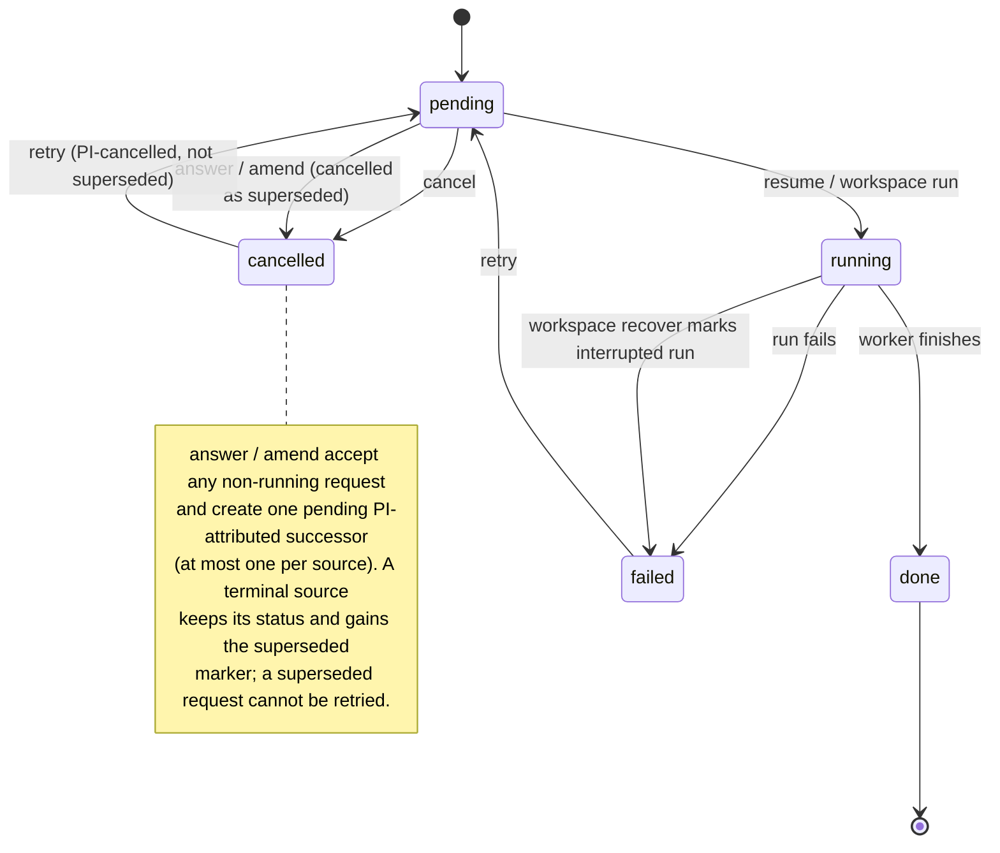

# Control plane reference

The shipped control plane is the operation request table in
`.memoria/memoria.sqlite`, surfaced through the `memoria request ...`,
`memoria workspace ...`, and `memoria attention ...` commands.

## Current Commands

```bash
memoria request list --workspace <workspace>
memoria request show --workspace <workspace> <request-id>
memoria request answer --workspace <workspace> --idempotency-key <new-key> <request-id> key=value
memoria request amend --workspace <workspace> --idempotency-key <new-key> <request-id> key=value
memoria request retry --workspace <workspace> <request-id>
memoria request cancel --workspace <workspace> <request-id>
memoria request resume --workspace <workspace> <request-id>
memoria workspace run --workspace <workspace>
memoria workspace recover --workspace <workspace>
memoria attention list --workspace <workspace>
```

Request controls are PI-only.

| Control | Current contract |
| --- | --- |
| `answer` / `amend` | Require a new idempotency key and a non-running operation request. They create one pending, PI-attributed successor, bind the source in provenance and causal references, and omit the source schedule. A pending source becomes `cancelled` as superseded; a terminal source keeps its status and gains the successor marker. The source envelope never changes. |
| `cancel` | Changes only `pending` to `cancelled`. Running and terminal requests are rejected. |
| `retry` | Changes `failed` or explicitly PI-cancelled work back to `pending`. A superseded request cannot be retried. |
| `resume` | Claims and runs only `pending` work. |

A source has at most one successor. Repeating the same answer or amendment with
the same key and content returns that successor; changed content or a second
successor conflicts. An amendment cannot change an ID, reference, path, target,
or other scope-bearing field. Submit a new original operation when scope must
change. Integrity-only operations cannot be copied into a PI successor. If a
state transition commits but its lifecycle-event append is interrupted, an
exact repeat appends that one missing event without creating another successor
or reopening work that has since finished.

The full request lifecycle, with the state each control accepts:



The local CLI's `--actor` value records declared provenance; it does not
authenticate a caller. Keep the raw CLI PI-owned. MCP binds its request actor to
`agent`. The loopback HTTP transport binds its request actor to `pi` — it is the
one adapter that authenticates its caller, with a per-boot bearer token the user
holds, over a loopback-only bind. Neither adapter reads a caller-supplied actor.

## Actor Authority Guard

A fixed subset of operations requires a specific actor before the worker will
run them at all. `_require_operation_actor` is the first check inside
`_run_operation_job` — it runs before any payload validation. A mismatched
actor fails the job with `"{operation_id} requires {label} actor authority"`
and the rejected job appends zero `event_log` rows.

The live roster is `PROTECTED_OPERATION_ACTORS` in `worker.py`:

| Required actor | Operations |
| --- | --- |
| `pi` | `apply-decision-rule-notices`, `acknowledge-attention`, `resolve-attention`, `resolve-evidence`, `record-copi-interview`, `curate-note-candidate`, `curate-note-link`, `move-concept`, `mark-checked`, `update-work`, `frame-paper`, `promote-draft-passage`, `cascade-rollback`, `seed-install`, `capture-remote-pdf-source` |
| `integrity` | `trace-integrity-scan`, `observe-pi-edits` |

Some PI-only actions are *additionally* guarded in the CLI handler
(`_require_pi_actor`) before they reach the runtime function; that is a second
check on the same authority, not an alternative to this table. The table above
is the complete list of worker-dispatched protected operations, not of every
PI-only action — a CLI-only action such as `memoria steering edit` never
becomes a request at all.

Authority is not authorship. Passing this guard says the request may run, not
that a human wrote its content: the loopback HTTP transport holds `pi` authority
while the bodies it posts are composed by a plugin or an agent. Those bodies are
still neutralized before they are written — the request envelope records
`machine_authored`, and the trusted writer gates untrusted-Markdown
neutralization on that field rather than on `actor`.

## WIP Limits

The standalone runtime does not enforce external board WIP limits. Concurrency
belongs to the standalone engine/runner and any operator-managed scheduler that
invokes it.

## Related

- CLI command surface: [CLI](../commands-and-transports/cli.md)
- Operation manifests: [Operations](../commands-and-transports/operations.md)
- Runtime telemetry examples: [Telemetry & logs](../pipelines-and-io/telemetry.md#log-schemas)
- Working the queue day to day: [Work the action queue](../../how-to-guides/inbox/work-the-action-queue.md)
- When a request sticks: [Fix a stuck request](../../how-to-guides/troubleshooting/fix-stuck-card.md)
- Why the states are shaped this way: [Control-plane states](../../explanation/execution/control-plane/states.md)
