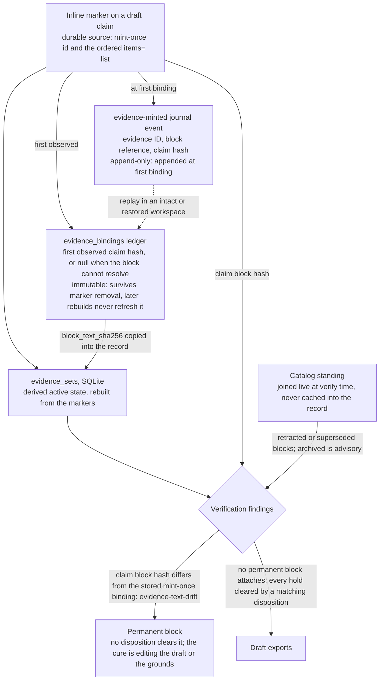

# Evidence sets

Evidence sets are the draft-time grounds contract for composed project
prose. The durable source is the inline marker on a draft claim. The marker
carries the mint-once id and the ordered `items=` list — nothing else:

```text
%%ev: ev-1234abcd items=source-alpha#^p0001|source-alpha#^p0002%%
```

`type`, `state`, and `review_required` are always derived from the items
and never serialized: a stored copy of a derived value can only be
redundant or wrong. Human-readable status lives in the verify report,
never in the marker.

Only a plain, top-level Markdown paragraph claim can establish a new binding.
Markers and block anchors inside Markdown code, headings, HTML comments or
elements, frontmatter, title metadata, reference definitions, fenced Divs,
multiline inline constructs, tables, line blocks, blockquote, list, or
definition-list containers cannot mint a new evidence ID. If they repeat an
existing ID, Memoria retains them as unbound and blocks draft export.
A duplicate group containing a direct visible marker or an ID already in the
immutable ledger is unbound and blocks export for every draft that contains it.
Hidden-only, never-bound occurrences stay nonbinding and cannot mint an ID.

Memoria fails closed when renderer syntax can make a line ambiguous: raw HTML
elements, raw TeX or math syntax, Pandoc attributes, footnote definitions,
initial MultiMarkdown-style metadata, abbreviation definitions, and table
syntax make the whole draft ineligible to mint a new binding. This conservative
rule also applies when the syntax appears in otherwise literal code. Ordinary
literal-code delimiters do not taint unrelated visible prose, but controls
inside code are never direct evidence. These rules avoid giving a hidden
renderer construct an evidence binding that only visible prose may establish.

## Items and derived fields

| Field | Meaning |
| --- | --- |
| `id` | Mint-once `ev-<8hex>` identifier. |
| `items` | Ordered `\|`-separated list: `work_id#^pNNNN` source-span refs, nested `ev-<8hex>` set refs, or `code-grounds:<run_id>:<artifact_id>:sha256:<64hex>` refs. Empty or omitted means no items. An item matching no grammar fails the record closed at parse. |
| `type` | Derived from the record's own items (see the table below), never asserted. |
| `state` | `complete` only when every item resolves; `implicit` is always `evidence-incomplete`. |
| `review_required` | `true` exactly when the type is `implicit` or `multi-hop`. |
| `block_text_sha256` | The mint-once SHA-256 binding copied from the immutable `evidence_bindings` ledger; nullable only to represent an unbound, fail-closed row. |

Type derivation is first-match over the record's own items:

| Items shape | Type | Routed |
| --- | --- | --- |
| No items | `implicit` | PI review |
| Any nested set ref, spans naming two or more distinct works, or a code ref mixed with any non-code item | `multi-hop` | PI review |
| Code refs only | `computed` | Machine |
| Spans in one work, exactly one | `single-span` | Machine |
| Spans in one work, two or more | `multi-span` | Machine |

A span resolves through the work's extracted content anchor. A code ref
resolves only while the recorded run exists, succeeded, and the pinned
output hash still matches; verification never executes code. A nested set
ref resolves only if the referenced set exists and is itself `complete` —
completeness is transitive, and every member of a reference cycle is
`evidence-incomplete`, fail-closed. Running code grounds the output
provenance; it does not make the research claim true.

## The mint-once ledger and the journal

SQLite table `evidence_sets` is derived active state rebuilt from those markers. A separate
`evidence_bindings` ledger records the first observed appearance of each
evidence ID: its anchored claim hash when resolvable, or `null` when it is
not. The ledger survives marker removal, so a reappearing ID always retains
its original binding.

The hash covers the Markdown paragraph or block containing the matching
`^blk-<8hex>` anchor. Before hashing, Memoria removes that anchor and its
`%%ev: ... %%` control marker, then trims outer whitespace. The first observed
ID records that hash, or `null` if the block cannot resolve. Later rebuilds,
including removal and reappearance of the marker, never refresh that value.
Changing the claim therefore cannot silently bless the edit with a new binding.

At first binding, Memoria also appends an `evidence-minted` journal event
carrying the evidence ID, block reference, and claim hash. The bindings
ledger is rebuildable by replaying those authoritative event-log entries in
an intact or restored workspace. Exporting/importing a journal into a
folder copy that excludes `.memoria` is outside this reference's scope.

What each store holds, how long it lasts, and how it reaches the export gate:



Source-span refs use stable `work_id`, never citekeys. Citekeys are rendered
only during export.

## Verification findings

Findings fall in three classes; the class, not the finding, defines what a
PI disposition may do. A draft exports only when no permanent block attaches
and every hold is cleared by a matching disposition. Advisories never
refuse export.

Permanent blocks — no disposition clears them; the cure is editing the
draft or the grounds:

| Finding | Severity | Trigger |
| --- | --- | --- |
| `evidence-text-drift` | high | Claim block hash differs from the stored mint-once binding. |
| `evidence-text-unbound` | high | Stored binding missing, or the anchored block cannot resolve. |
| `evidence-id-duplicate` | high | One ID bound by more than one occurrence. |
| `evidence-source-stale` | high | Any work in the record's item closure has catalog standing `retracted` or `superseded`. Carries `work_id` and `path` — empty path is a direct item, non-empty is inherited through nested sets. |
| `no-evidence-set` | high | The draft contains zero evidence sets. |

PI-clearable holds — block until a disposition for this exact record:

| Finding | Severity | Trigger |
| --- | --- | --- |
| `evidence-incomplete` | high | Any item fails to resolve, or the set is `implicit`. |
| `review-required` | medium | The derived type is `implicit` or `multi-hop`. |

Advisories — surfaced, never blocking:

| Finding | Severity | Trigger |
| --- | --- | --- |
| `evidence-source-archived` | medium | Any closure work has standing `archived`. |

Catalog standing is joined live at verify time, never cached into the
record: a source retracted years after a claim was written still blocks.
An unset standing is `current` by design — standing is PI-curated catalog
state, and the PI is the standing authority. `evidence-source-stale` is not
PI-disposable: if the claim is about the retraction itself, re-ground it on
the retraction notice cataloged as its own work.

## Dispositions

Only the PI can record a disposition:

```bash
memoria project resolve-evidence --workspace <workspace> <project> --evidence-id ev-1234abcd --decision accept
```

The disposition is journal provenance; it does not edit the marker or assert
that the claim is true. It is bound to content: the event records a digest
of the record's ordered items, and verification honors the disposition only
while the current items match. Editing the items voids the disposition (the
journal keeps it; it is simply inert) and the record re-routes to review.
A disposition can clear `evidence-incomplete` and `review-required`; it can
never clear a permanent block.

## Related

- Where markers are minted and resolved during drafting: [Compose a draft](../../how-to-guides/project/compose-a-draft.md)
- How resolved markers become citations at export, and what blocks export: [Export routes and formats](../pipelines-and-io/export.md)
- Why the engine may verify markers but not decide a claim is true: [Why the write half is bounded](../../explanation/rationale/boundaries/why-write-half-is-bounded.md)
- The principle behind the immutable binding ledger: [Design principles](../../explanation/rationale/foundations/design-principles.md) (Provenance everywhere)
