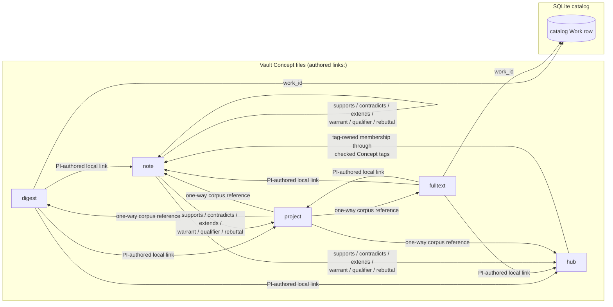

# Wikilink and link conventions

Memoria's knowledge-link topology covers `digest`, `fulltext`, `note`, `hub`,
and `project` documents. `code-artifact` is also a schema-owned typed document,
but it is a project artifact rather than a human knowledge Concept. Wikilinks
and `links:` express authored PI relationships between Concept documents.
Catalog Work rows live in SQLite and provider payloads; they are not `paper`,
`person`, or `venue` Concept files.

---

## Link forms

| Form | Example | Meaning |
| --- | --- | --- |
| Body wikilink | `[[notes/receptivity.md]]` | Plain human reference; never becomes an argument edge by itself. |
| Typed body shorthand | `[[supports::notes/target.md]]` | Creates an unchecked edge-candidate attention item; the worker does not edit `links:` automatically. |
| Frontmatter `links:` | `supports: [notes/target.md]` | Authored argument edge accepted into the Concept frontmatter. |
| Hub tag membership | `tags: [jitai]` with hub `tag: jitai` | Mechanical topic membership; the hub body owns curation and ordering. |

---

## Authored links

Knowledge Concepts carry `links:` as the authored relationship map specified by
the generated [Frontmatter fields](frontmatter.md). The six frontmatter-legal
link relations are:

| Link | Direction |
| --- | --- |
| `supports` | This Concept supports the linked Concept. |
| `contradicts` | This Concept contradicts the linked Concept. |
| `extends` | This Concept builds on the linked Concept. |
| `warrant` | This Concept licenses the inference the linked Concept makes (Toulmin role). |
| `qualifier` | This Concept bounds the linked Concept's scope or strength (Toulmin role). |
| `rebuttal` | This Concept names the condition under which the linked Concept fails (Toulmin role). |

`tension` is a seventh edge relation the machine surfaces and the PI confirms;
it is never authored in `links:`
([Frontmatter fields](frontmatter.md#links-and-catalog-resources)).

```yaml
links:
  supports:
    - notes/target.md
  contradicts: []
  extends: []
  warrant: []
  qualifier: []
  rebuttal: []
```

Rules:

- Link targets are vault-relative paths, not title-only links.
- A `note` with `mode: claim` needs evidence in its body, anchors, checked
  digests, or catalog Work rows; `links:` records the argument relation, not
  the evidence store.
- A bare wikilink remains a body reference.
- A proposed machine edge is not canonical until accepted through the attention
  path.

Catalog/provider relationships such as citations, authors, venues, OpenAlex
related Works, and entity IDs live in SQLite records and provider payloads. They
are given facts from ingest/enrichment, not authored `links:` frontmatter. The
`work_graph_edges` `relation_type` roster is `references`, `related`, `topic`,
`keyword`, `authorship`, `institution`, `published_in`
(`src/memoria_vault/runtime/schema.sql`).

---

## Expected topology

Two planes: authored relationships between vault Concept files, and the SQLite
catalog Work row each `digest` and `fulltext` reaches through `work_id`.



---

## Hub thresholds

The `hub-threshold` linter detector is advisory: it fires when a topic has
roughly 15 or more checked notes and no covering hub. A `hub` Concept for a
topic owns one tag. Why hub creation waits for the threshold is discussed in
[Hubs and navigation](../../explanation/rationale/knowledge-rationale/hubs-and-navigation.md).

---

## Slug conventions

| Concept | Path shape | Example |
| --- | --- | --- |
| catalog work | `catalog/sources/<work-id>` | `catalog/sources/personal-informatics-sensemaking` |
| `digest` | `digests/<work-id>.md` | `digests/personal-informatics-sensemaking.md` |
| `fulltext` | `fulltexts/<work-id>.md` | `fulltexts/personal-informatics-sensemaking.md` |
| `note` | `notes/<claim-or-question>.md` | `receptivity-decreases-under-high-burden.md` |
| `hub` | `hubs/<topic>.md` | `jitai.md` |
| `project` | `projects/<project>/project.md` | `projects/dissertation/project.md` |

The stable **internal id** is the ULID `id`, not the filename — distinct from
the path-derived **OKF Concept ID** used at the export boundary (see [OKF
compliance contract](okf-compliance.md)). Renames are still rare: they churn
links and require a scan/check pass.

---

## Vocabulary discipline

The `research_area`, `methodology`, and topic tags use the controlled lists in
[Vocabulary](vocabulary.md), whose runtime home is `system/vocabulary.md`.
Richer provider taxonomies such as OpenAlex topics are catalog metadata, not
hand-authored frontmatter vocabulary.

---

## Related

- How-to for setting authored links: [Link checked notes](../../how-to-guides/knowledge/link-checked-notes.md)
- Field contract: [Frontmatter fields](frontmatter.md)
- Current Concept types: [Document types](document-types.md)
- Why notes are filed by lifecycle, not topic: [Lifecycle and state](../../explanation/rationale/knowledge-rationale/lifecycle-and-state.md)
