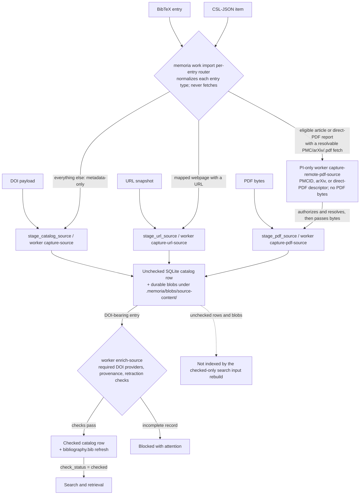

# Ingest routing

Worker capture starts the catalog record, but scholarly identifiers do not
become checked Work rows before provider verification. Worker
`capture-source` stages DOI inputs as unchecked SQLite catalog rows plus
durable content/raw blobs under `.memoria/blobs/source-content/`; worker
`enrich-source` resolves required DOI providers, records provenance, and checks
the row only when provider and retraction checks pass.

The runtime helper `memoria_vault.runtime.capture.stage_catalog_source()` handles
source payloads: it records a capture run, writes raw and extracted text blobs,
writes source metadata into SQLite catalog state, and records derived
aspects/edges there. Portable BibTeX/CSL imports use the same unchecked SQLite
staging path. PyMuPDF is a standard runtime dependency. Before parsing,
`stage_pdf_source()` rejects raw PDF input larger than 32 MiB; it also rejects
documents above 1,000 pages or more than 8 MiB of extracted UTF-8 text. URL snapshots
use `stage_url_source()` with stdlib HTML text extraction.

## Pipeline contract

The route each entry format takes into unchecked staging, then through the
enrichment gate to the read barrier:

| Step | Owner | Output |
| --- | --- | --- |
| Capture event | worker `capture-source` / `capture_source()` | First journal `run` event with `workflow: capture_source`, before durable content is written. |
| DOI staging | `stage_catalog_source()` via worker `capture-source` | Writes an unchecked SQLite catalog row and durable blobs under `.memoria/blobs/source-content/<work_id>/`; no `source.md` or `bibliography.bib` update is written before enrichment. |
| DOI enrichment | `enrich_source()` via worker `enrich-source` | Resolves required DOI providers, records provenance and Work graph rows, blocks incomplete records with attention, then checks passing catalog rows and refreshes `bibliography.bib`. |
| Raw copy | `capture_source()` / `stage_catalog_source()` | Writes `.memoria/blobs/source-content/<work_id>/raw/<filename>` plus `raw_text_sha256`. Raw blobs are gitignored and require backup coverage outside the vault. |
| Extracted content | `capture_source()` / `stage_catalog_source()` | Writes `.memoria/blobs/source-content/<work_id>/content.txt` plus `normalized_text_sha256`. Structured CSL aspects and explicit full-text sections populate the `work_aspects` read model. |
| BibTeX import | `memoria work import --format bibtex` / worker `capture-source` | Parses each BibTeX entry into unchecked catalog metadata and a raw `.bib` blob; `--enrich` also queues `enrich-source` for each newly admitted DOI-bearing entry. |
| CSL import | `memoria work import --format csl` / worker `capture-source` | Parses each CSL-JSON item into unchecked catalog metadata and a raw `.csl.json` blob; `--enrich` also queues `enrich-source` for each newly admitted DOI-bearing item. |
| Import entry routing | `memoria work import` per-entry router | Normalizes each entry's type onto the shipped `article/book/webpage/software/dataset/report` vocabulary, then routes it: a mapped webpage with a URL goes to the operation `capture-url-source`, an eligible article or direct-PDF report with a resolvable PMC/arXiv/`.pdf` fetch goes to the PI-only operation `capture-remote-pdf-source`, and everything else stays on the metadata-only operation `capture-source`. The command itself never fetches. |
| Import run artifacts | `memoria work import` at command return | Skips entries whose `work_id` is already in the catalog, then finalizes once, after the post-loop index refresh: one run-scoped `import-<run_id>` worklist with one quiet card, ranked duplicates → retraction → failed → unmapped, plus one [`import-run.v1`](../control-and-policy/empirical-events.md) telemetry row. A run with nothing to judge mints no worklist and no card. A retried import mints a new `run_id` and reports the retry, not the original run. |
| URL snapshot | `stage_url_source()` / worker `capture-url-source` | Fetches one URL, preserves raw HTML, extracts plain text with stdlib `HTMLParser`, and writes an unchecked catalog row plus source-content blobs. |
| PDF import | `stage_pdf_source()` / worker `capture-pdf-source` | PyMuPDF is a standard runtime dependency. Before parsing, `stage_pdf_source()` rejects raw PDF input larger than 32 MiB; it also rejects documents above 1,000 pages or more than 8 MiB of extracted UTF-8 text before writing an unchecked catalog row plus source-content blobs. |
| Policy-bound remote PDF capture | internal import-admission request / PI worker `capture-remote-pdf-source` | Accepts a PMCID, arXiv, or direct-PDF descriptor but no PDF bytes; the PI-only worker authorizes every resolved URL against the finite ten-prefix policy, refuses redirects, and passes admitted bytes to the standard 32 MiB / 1,000-page / 8 MiB `stage_pdf_source()` boundary. This is an internal route, not a new CLI command. |
| Metadata merge | `capture_source()` / `enrich_source()` | Recapturing or enriching the same stable `work_id` merges non-empty identifiers, CSL-JSON fields, metadata status, and link lists instead of dropping previously captured source metadata. |
| Metadata-derived entities | `capture_source()` / `enrich_source()` | Records deterministic person, venue, organization, and source graph rows from CSL/OpenAlex metadata; exact duplicate checks read these rows. |
| Metadata check | `check_source_metadata()` / worker `check-source-metadata` | Flags missing catalog basics, conflicting DOI metadata, duplicate source IDs, deterministic duplicate Work candidates, and duplicate person/entity identifiers for PI review. |
| Provider policy | `.memoria/config/providers.yaml` | Declares required DOI providers, endpoint templates, timeouts, and contact-email environment variables. The operation manifest allowlist must agree with enabled provider base URLs. |
| Catalog Work row | catalog state | Source metadata lives in `.memoria/memoria.sqlite` with a mirror concept id of `catalog/sources/<work_id>` and DB/read-API `check_status`. Human interpretation starts in `notes/` as `mode: work` notes. |
| SQLite catalog row | `memoria_vault.runtime.state` | Writes staged or checked source metadata, enrichment runs, provider payload paths, external IDs, field provenance, and first-order Work graph edges in `.memoria/memoria.sqlite`, the catalog working-state source of truth. |
| Bibliography projection | `write_references_bib()` / worker projection refresh | Regenerates `bibliography.bib` from checked SQLite catalog rows. Enrichment materializes it in the same worker commit after required providers pass; `check_references_bib()` checks this file, and `check_tracked_projections()` covers it with the rest of the tracked projection set. |
| Commit | trusted writer / projection writer | Capture writes SQLite state and gitignored blobs. DOI capture writes unchecked state only; enrichment and explicit projection refreshes commit required tracked projections such as `bibliography.bib`. Raw and provider blobs stay out of git. |

## Details and edge cases

- DOI enrichment fetches provider-discovered open-access text only when the
  operation manifest allows that URL.
- `capture-remote-pdf-source` uses a no-redirect resolver. Every initial or
  derived URL must be authorized against these ten explicit prefixes:

  - `https://www.ncbi.nlm.nih.gov/pmc/utils/oa/`
  - `https://ftp.ncbi.nlm.nih.gov/pub/pmc/oa_pdf/`
  - `https://ftp.ncbi.nlm.nih.gov/pub/pmc/oa_package/`
  - `https://www.frontiersin.org/journals/psychology/articles/`
  - `https://www.frontiersin.org/journals/education/articles/`
  - `https://www.frontiersin.org/journals/artificial-intelligence/articles/`
  - `https://discovery.ucl.ac.uk/id/eprint/10077673/1/`
  - `https://aclanthology.org/`
  - `https://sociologica.unibo.it/article/download/`
  - `https://export.arxiv.org/pdf/`

  A URL outside this finite policy fails its worker job before an opener runs;
  it is never silently downgraded into generic metadata capture.
- Portable imports can carry ISBN metadata, but the standalone runtime has no
  `work add --isbn` enrichment route.
- Source/entity Markdown is never created during import; checked catalog state
  and `bibliography.bib` appear through worker materialization.
- Ambiguous entity disambiguation, parser selection, and richer PDF coherence
  gates remain follow-on work.

The current extraction inputs are normalized markdown text, staged DOI payloads,
one BibTeX entry, one CSL-JSON item file, one URL snapshot, or PDF bytes parsed
by the standard PyMuPDF runtime dependency.

## Catalog Work Record

Work identity and verdict state live
in SQLite catalog rows and read-API responses:

| Field | Source |
| --- | --- |
| `work_id`, `title`, `description` | Required catalog identity fields. |
| `check_status` | DB/read-API verdict; never Concept frontmatter. |
| `resource`, `citekey`, `item_type`, `identifiers`, `csl_json`, `provider_coverage` | Metadata supplied by capture or enrichment. |
| `text_status` | `full-text`, `abstract-only`, or `metadata-only`; only `full-text` can produce a checked digest. |
| `raw_copy_path`, `content_path` | Relative paths to the raw blob and extracted markdown. |
| `raw_text_sha256`, `normalized_text_sha256` | Content hashes used by trace and later integrity checks. |

The `work_id` is the stable Work identifier. Citekeys are aliases and may be
corrected without renaming the Work; `memoria work update` refreshes the SQLite
catalog row before `bibliography.bib` is rendered.

## Read Barrier

The captured source enters search/retrieval only after the DB/read API reports
`check_status = checked`.
Unchecked staged catalog rows, provider payloads, source-content blobs,
quarantined files, and raw blobs are not indexed by the checked-only search
input rebuild.

## Not shipped

- ISBN URL-depth enrichment.
- Live URL smoke beyond mocked single-page fetch tests.
- PubMed, arXiv, broad source-discovery search, and UI.
- Parser selection and richer coherence gates for PDFs and other source formats.
- Ambiguous entity disambiguation beyond exact deterministic CSL author and venue paths.

## Related

- Catalog Work record fields: [Frontmatter fields](../data-model/frontmatter.md)
- DOI enrichment gate decision: [DOI catalog enrichment gates checked source promotion](https://github.com/eranroseman/memoria-vault/blob/main/design-history/arcs.md)
- Folder homes and skeleton: [Memoria configuration](../system/configuration.md)
- Checked-only retrieval: [Search](search.md)
- Trusted writer and journal behavior: [System actions](../commands-and-transports/system-actions.md)
- The per-source how-to: [Capture and ingest a source](../../how-to-guides/library/capture-and-ingest.md)
