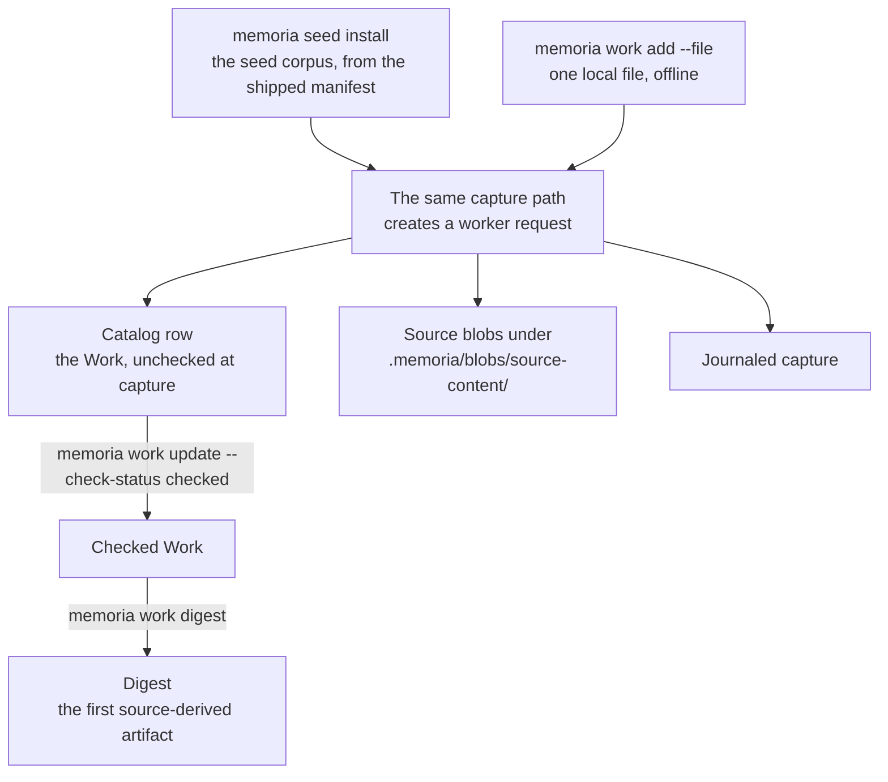

# 02: First source

This tutorial fills the catalog with `memoria seed install` — eight openly
licensed sources on knowledge-work cognition (note-taking, external memory,
spaced retrieval, argumentation, LLM-assisted research), fetched keyless
from a shipped manifest. If you are offline, one local file gives you the
same capture path; the corpus is the paved road, never a gate.

## Steps

**1. Install the seed corpus.**

```bash
memoria seed install --workspace .
```

The command iterates the shipped manifest (pinned identifiers, verified
licenses, keyless fetch URLs), downloads each source, and routes it through
the same capture path as a local PDF. Failures are per-row: a fetch that
fails names its row and the run continues. Re-running is safe — already
admitted rows are skipped, and a full-skip re-run performs no fetches and
exits clean.
Notice the admitted rows in the output. If you had skipped the framing step
in Tutorial 01, the command would print a frame-your-project-first notice
and proceed.

**2. Offline alternative: capture one local file instead.**

No network? The same capture path accepts any local content (a local PDF
works too, via `--pdf`):

```bash
mkdir -p tmp/tutorial
printf 'A short source about just-in-time adaptive interventions.\n' > tmp/tutorial/first-source.txt
memoria work add --workspace . \
  --file tmp/tutorial/first-source.txt \
  --title "First tutorial source" \
  --json
```

Either way — seed corpus or local file — capture creates a worker request,
writes a catalog row, stores source blobs under
`.memoria/blobs/source-content/`, and journals the capture.

Both entry branches land in the same place, and the steps below run from
there:



**3. Inspect one Work record.**

List the catalog and pick one `work_id` (from the seed install output or
the JSON below):

```bash
memoria list --workspace . --type work --json
memoria work export --workspace . <work-id> --json
```

Look for `check_status`, `content_path`, `raw_path`, and hash fields. Those
are the provenance anchors the rest of the system reads.
The paths should point under `.memoria/blobs/source-content/`.

**4. Check the Work after reviewing it.**

Captures start unchecked. After inspecting the exported record and source
text, record the PI decision that makes it available to checked-read
operations:

```bash
memoria work update --workspace . <work-id> --check-status checked
```

**5. Capture a companion repository (needs network).**

A paper's repo is often the method's only complete specification —
capturing both is the habit worth building. The seed corpus's OpenScholar
paper ships with one. Skip this step if you are working offline:

```bash
memoria work add --workspace . \
  --url https://github.com/AkariAsai/OpenScholar \
  --title "OpenScholar companion repository"
```

**6. Compile a digest when a source is ready.**

Use the `work_id` you checked in step 4:

```bash
memoria work digest --workspace . <work-id> --mode test
```

The digest path uses the manifest-pinned runner for the selected mode. Use
`--mode live` only after provider config and the seeded-error gate support
it.
Notice the digest path or request result. The digest is the first
source-derived artifact you can inspect.

## What you should have seen

- The seed corpus is fetched on onboarding from a shipped manifest —
  pinned, openly licensed, keyless — never bundled content.
- Capture enters through the request/worker path, online or offline.
- Source bytes and normalized text are blobs, not frontmatter.
- A captured Work remains unchecked until the PI checks it.
- A digest is source-derived material keyed by `work_id`.

For more detail on capturing sources by DOI, URL, or PDF:
[Capture and ingest](../how-to-guides/library/capture-and-ingest.md). For the
routing inside the capture path:
[Ingest routing](../reference/pipelines-and-io/ingest.md).

Next: [03: Connect notes](03-connect-notes.md).
